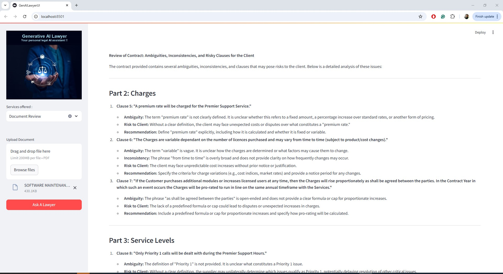

## GenerativeAI Lawyer [DeepSeek R1 + Ollama + FAISS]
Your personal legal AI assistant !!
Customers - Say goodbye to expensive legal consultation, long waits for appointments, and confusing legal texts. 
Laywers - Say goodbye to routine tasks. AI Lawyer automate your legal research and paperwork, granting you more free time.


# How to run?
### Steps :

Clone the repository

```bash
Project repo: https://github.com/vaibhavdhingani/genai_personal_legal_assistant_deepkeekr1_ollama_faiss.git
```

### Step-1 : Create a python environment after opening the repository
```bash
python -m venv lawyerchatbotenv
source lawyerchatbotenv/Scripts/activate
```

### Step-2 : install the requirements
```bash
pip install -r requirements.txt
```

### Step-3 : Create account for Groq and ElevenLabs and generate API Keys
```bash
https://console.groq.com
```

### Step-4 : Create a `.env` file in the root directory and add your Groq credentials as follows:
```ini
GROQ_API_KEY = "xxxxxxxxxxxxxxxxxxxxxxxxxxxxx"
```

### Step-4 : Execute the python files:
```bash
streamlit run gradio_app.py
```
_[This repo has been verified with Python 3.12.5. I have seen few package compilation issues with higher version on Python.]_

### Step-5 : Execute the GenAIMedical Chatbot:
```bash
## Open localhost
open http://localhost:8501
```

### Stack Used:
- Deepseek R1
- Ollama
- FAISS
- GROQ
- Streamlit



